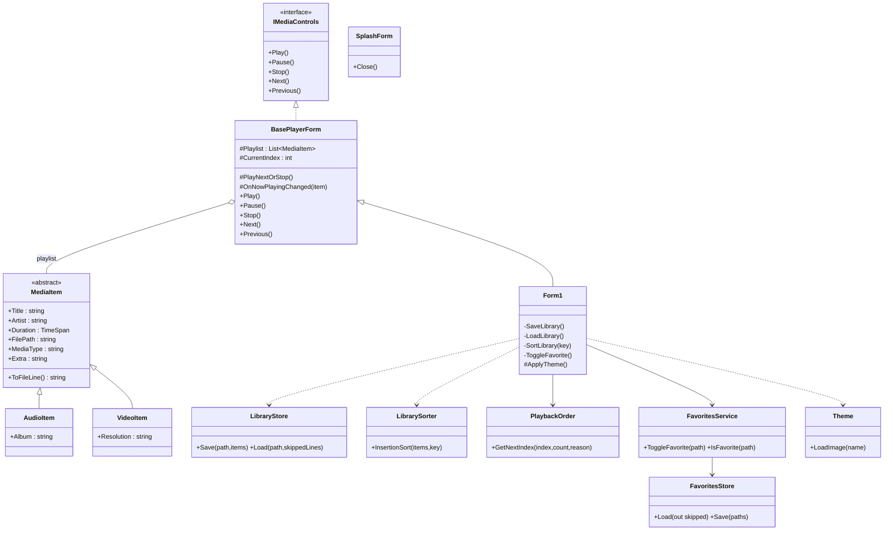

# Class diagram (M1)

```mermaid
classDiagram
 class IMediaControls {
  <<interface>>
  +Play()
  +Pause()
  +Stop()
  +Next()
  +Previous()
 }
 class MediaItem {
  <<abstract>>
  +Title : string
  +Artist : string
  +Duration : TimeSpan
  +FilePath : string
  +MediaType : string
  +Extra : string
  +ToFileLine() string
 }
 class AudioItem { +Album : string }
 class VideoItem { +Resolution : string }
 class BasePlayerForm {
  #Playlist : List~MediaItem~
  #CurrentIndex : int
  #PlayNextOrStop()
  #OnNowPlayingChanged(item)
  +Play()
  +Pause()
  +Stop()
  +Next()
  +Previous()
 }
 class Form1 {
  -SaveLibrary()
  -LoadLibrary()
  -SortLibrary(key)
  -ToggleFavorite()
  #ApplyTheme()
 }
 class LibraryStore { +Save(path,items) +Load(path,skippedLines) }
 class LibrarySorter { +InsertionSort(items,key) }
 class PlaybackOrder { +GetNextIndex(index,count,reason) }
 class FavoritesService { +ToggleFavorite(path) +IsFavorite(path) }
 class FavoritesStore { +Load(out skipped) +Save(paths) }
 class Theme { +LoadImage(name) }
 class SplashForm { +Close() }
 IMediaControls <|.. BasePlayerForm
 MediaItem <|-- AudioItem
 MediaItem <|-- VideoItem
 BasePlayerForm <|-- Form1
 BasePlayerForm o-- MediaItem : playlist
 Form1 ..> LibraryStore
 Form1 ..> LibrarySorter
 Form1 --> PlaybackOrder
 Form1 --> FavoritesService
 FavoritesService --> FavoritesStore
 Form1 ..> Theme
```

The required inheritance, interface and polymorphic media model are shown. Library file I/O is separate from the WinForms interface.