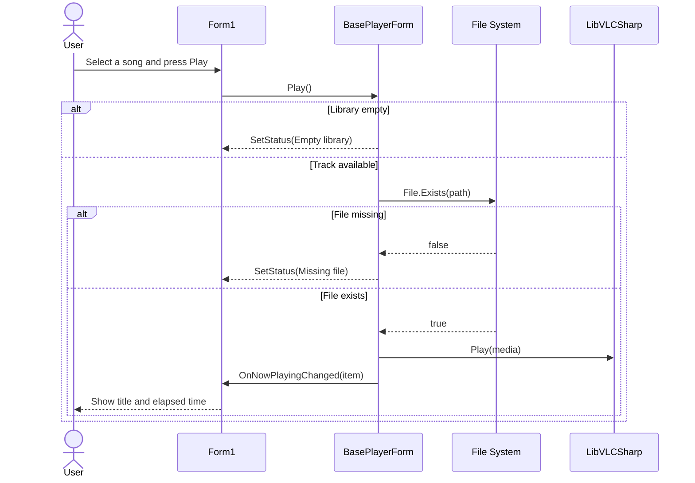

# Sequence diagram — Play command

```mermaid
sequenceDiagram
 actor User
 participant UI as Form1
 participant Base as BasePlayerForm
 participant FS as File System
 participant VLC as LibVLCSharp
 User->>UI: Select a song and press Play
 UI->>Base: Play()
 alt Library empty
  Base-->>UI: SetStatus(Empty library)
 else Track available
  Base->>FS: File.Exists(path)
  alt File missing
   FS-->>Base: false
   Base-->>UI: SetStatus(Missing file)
  else File exists
   FS-->>Base: true
   Base->>VLC: Play(media)
   Base->>UI: OnNowPlayingChanged(item)
   UI-->>User: Show title and elapsed time
  end
 end
```